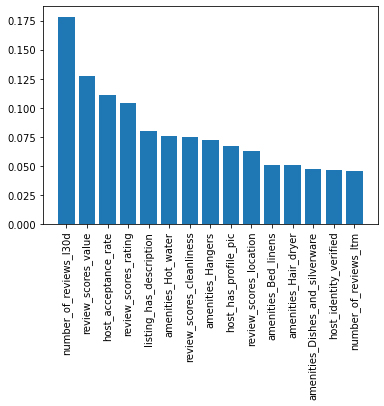
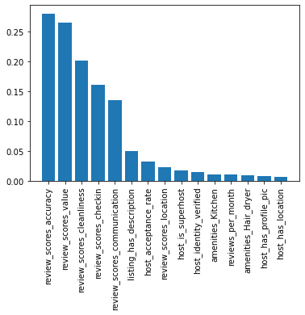

# AirBnB Cape Town Dataset Analysis

The motivation for this project is to understand more about how users experience accomodation in Cape Town, South Africa and what factors lead them to choose certain accomodation. I will be making use of the public dataset provided by AirBnB to answer some of the questions below.

**1. Which factors effect the number of bookings an AirBNB listing gets in a month?**

**2. Does the host's details effect how many bookings they receive in a month?**

**3. What contributes to a good review on a listing?**

_I will be making use of the pandas library as well as scikit learn to explore the data_

## Data Overview

| File Name             | Description                                                                                                                                                      |
| :-------------------- | :--------------------------------------------------------------------------------------------------------------------------------------------------------------- |
| `listings.csv`        | Detailed listings data for Cape Town, South Africa. This is the primary dataset used.                                                                            |
| `listings_detail.csv` | Data dictionary for the listings dataset. **More info:** https://docs.google.com/spreadsheets/d/1iWCNJcSutYqpULSQHlNyGInUvHg2BoUGoNRIGa6Szc4/edit#gid=1322284596 |

## Results Summary

After analysing the data and creating a predictive model, there are some notable factors that help AirBnB listings succeed. In this analysis I focused on reviews and ratings that were left by users as they give a good indication on whether a listing offers an enjoyable experience.

I had a look a two areas which can be used to answer the questions I posed earlier. One being the listing's reviews per month and the other being their rating value. I will use the reviews per month synonymously with how well a listing performs when it comes to bookings in a month. When a listing has higher reviews per month, we can assume that they (on average) have more bookings and therefore are more successful. I will be using the listing's rating value to determine how well users enjoyed their experience at the accomodation and the quality of the listing.

**A look into the results:**\
_Each graph shows the feature importance which respect to the title of the graph_

#### Reviews per month graph

From the graph above, we can see what factors effect the average reviews per a month (which correlates to the amount of bookings a listing gets per a month in a directly proportional manner). Some of the notable factors are: review score value, host acceptance rate and the review scores rating. It should also be noted that host details such as: profile picutre and identity verified do seem to contribute to more reviews per month.

One can deduce that having a high overall listing score as well as a high acceptance rate leads to the most bookings in a month. Some smaller factors that should be considered is ensuring your listing has a description as well as offering some unique amenities like hot water and hangers.

#### Rating value graph

The aim with this model is to find out what effects a good review from users. As suspected, the review scores dictate how the user scores their overall experience with a listing but looking at the graph, each scoring category seems to carry different weighting to a user. According to our model, users values (in order): listing accuracy, value for money, cleaniliness, checkin process and finally communication. It makes sense that communication is last when we found that the time it took for hosts to respond to users didn't have an impact on how they rated a property. There is a big difference between the effect that the review scores have on the final rating versus the rest of the columns; we could say that by looking at those scores we can be pretty sure as to how the user will rate their overall experience.

Some factors like whether the listing has a description and the host accpetance rate could contribute to a good review, although its not much it is worth noting.

*The blog post can be found here: https://medium.com/@cameronjames.dryden/how-to-get-more-people-to-visit-your-airbnb-in-cape-town-7e9747a5ecf3*

## Acknowledgements

- [AirBnB Dataset](http://insideairbnb.com/get-the-data/)
- [Overlook at Cape Town's AirBnB data](http://insideairbnb.com/cape-town/)
- [Pandas Data Analysis Tool](https://pandas.pydata.org/docs/)
- [Scikit-Learn Machine Learning](https://scikit-learn.org/stable/)
